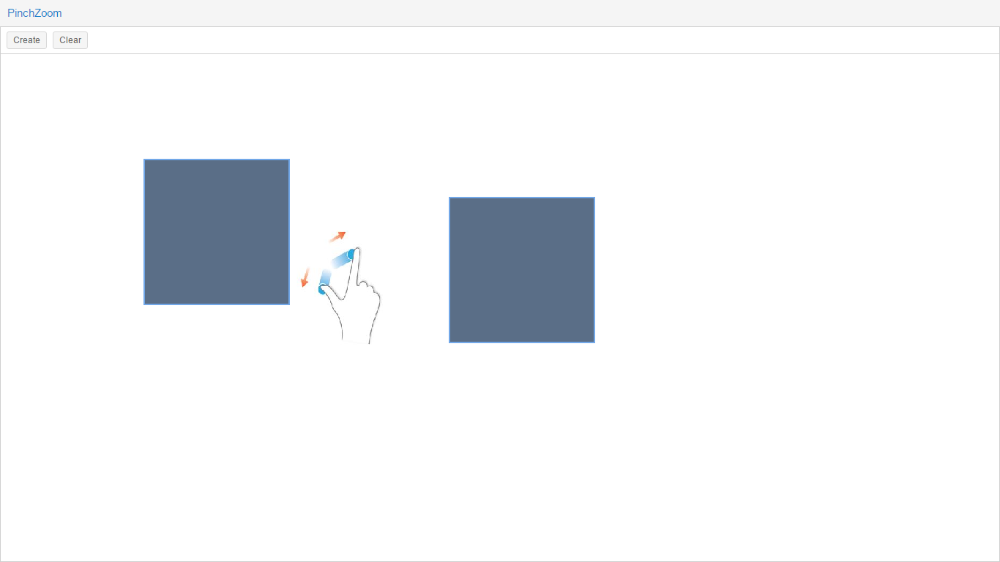

PinchZoom
===================

PinchZoom-a custom ExtJS component.
PinchZoom-一个ExtJS自定义组件，用作移动端Pinch手势对组件的缩放，同时也可以组件的移动，解决了ExtJS多焦点touch，组件会再多个焦点之间来回摆动的BUG。支持chorme，IE8+，FireFox，Safari浏览器。

### 在线deom地址
[在线demo](https://todayqq.github.io/PinchZoom/ "点击跳转")

### Resource

 - HanmmerJS- 2.0.6
 - ExtJS-6.0+


### Examples code
```
// get a container
var container = Ext.getCmp('panel');
// create pinchzoom component and show
var component = Ext.create({
	xtype: 'pinchzoom',
    parentDom: container,
    x: 100,
    y: 100,
    width: 200,
    height: 200
}).show();
```
> **Note:** pinchzoom css style 

> -  position:absolute


### Preview photo


### Component lifecycle

# License

[The MIT License](http://opensource.org/licenses/MIT)